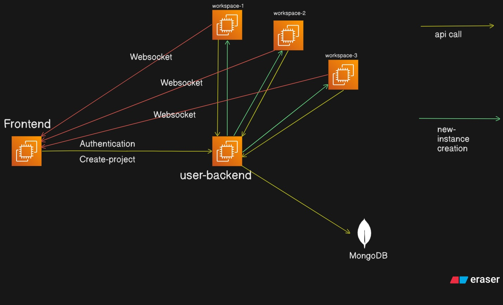

# ✨ Cloud IDE – Distributed Multi-Workspace Development Platform

A modern cloud-based IDE platform designed to provide **isolated compute workspaces on AWS EC2** for every user project.
This system delivers a seamless real-time coding experience using **Monaco Editor**, **Xterm terminal**, **WebSockets**, and **dedicated EC2 instances** for high performance.

---

## 🧠 System Architecture

### 🔍 High-Level Flow

When a user creates a project:

1. **Frontend (React)** handles authentication and UI
2. **User Backend**:

   * Authenticates user (Google OAuth)
   * Creates EC2 instance for each project
   * Stores metadata in MongoDB
3. **Workspace Backend** runs **inside each EC2 machine**:

   * File system operations
   * Terminal execution (node-pty)
   * Realtime WebSocket communication
4. **Frontend** connects directly to workspace via WebSockets → enabling interactive coding.

---

## 🏗️ Architecture Diagram



---

# 📦 Project Structure

```
/frontend                  → React + Vite frontend (Editor, Terminal UI)
/user-backend             → Auth, Project Management, EC2 Provisioning
/workspace-backend        → Terminal + FS backend, runs on EC2
```

---

# 🎨 Frontend

### 🛠️ Tech Stack

* React 19
* Vite
* Monaco Editor
* Xterm.js terminal
* Zustand
* React Router
* Material UI
* Socket.io client

### ✨ Features

* Google OAuth login
* Project dashboard
* Interactive code editor
* Live terminal
* Connects directly to isolated EC2 workspace

*(Full package.json already included)*

---

# 🧩 User Backend

### 🛠️ Tech Stack

* Express
* Mongoose
* AWS SDK (EC2)
* Google APIs
* Jest testing

### ✨ Responsibilities

* Authentication
* Project creation
* Provisioning EC2 instances
* Workspace mapping
* MongoDB data management

---

# 💻 Workspace Backend

### 🛠️ Tech Stack

* Express
* Socket.io
* node-pty
* Multer

### ✨ Responsibilities

* Execute terminal commands
* Handle filesystem operations
* Provide WebSocket-based code sync
* Serve as the isolated development environment

---

# ⚙️ How the Platform Works

### 1️⃣ User logs in

Frontend → User Backend → Google OAuth validation.

### 2️⃣ User creates a project

User Backend:

* Starts new EC2 instance
* Deploys workspace backend
* Returns workspace IP

### 3️⃣ Frontend connects to workspace

* Editor sync (Monaco)
* Terminal sync (Xterm + node-pty)

### 4️⃣ MongoDB stores:

* Users
* Projects
* Instance IDs
* Workspace metadata

---

# 🛠️ Local Development Setup

## Clone the Repository

```bash
git clone https://github.com/your-repo/cloud-ide.git
cd cloud-ide
```

---

## 📦 Install Dependencies

### Frontend

```bash
cd frontend
npm install
npm run dev
```

### User Backend

```bash
cd user-backend
npm install
npm run dev
```

### Workspace Backend

```bash
cd workspace-backend
npm install
node src/index.js
```

---

# 🔐 Environment Variables

### 🌐 Frontend

```bash
VITE_BACKEND_API=YOUR_BACKEND_API
VITE_GOOGLE_CLIENT_ID=YOUR_GOOGLE_CLIENT_ID
```

### 🔧 User Backend

```bash
#PORT
PORT=YOUR_PORT

#MONGO URI
MONGO_URI=YOUR_MONGO_URI

#PASSWORD SECRET
PASSWORD_SECRET=YOUR_PASSWORD_SECRET

#GOOGLE OAUTH
GOOGLE_CLIENT_ID=YOUR_GOOGLE_CLIENT_ID
GOOGLE_CLIENT_SECRET=YOUR_GOOGLE_CLIENT_SECRET

#AWS CREDENTIALS
AWS_REGION=YOUR_AWS_REGION
AWS_ACCESS_KEY_ID=YOUR_AWS_ACCESS_KEY_ID
AWS_SECRET_ACCESS_KEY=YOUR_AWS_SECRET_ACCESS_KEY
AWS_SECURITY_GROUP_ID=YOUR_AWS_SECURITY_GROUP_ID
```

### 💻 Workspace Backend

```bash
#PORT
PORT=YOUR_PORT

#BASE PATH
BASE_PATH=YOUR_BASE_PATH

#BACKEND_API
BACKEND_API=YOUR_BACKEND_API

#CLIENT URL
CLIENT_URL=YOUR_CLIENT_URL
```

---

# 🧪 Testing

### Run Tests

```bash
npm test
```

---

# 🙌 Contributors

```
202201155 – Divyarajsinh Chundavat  
202201199 – Vrund Leuva  
202201503 – Manoj Dhundhalva
```